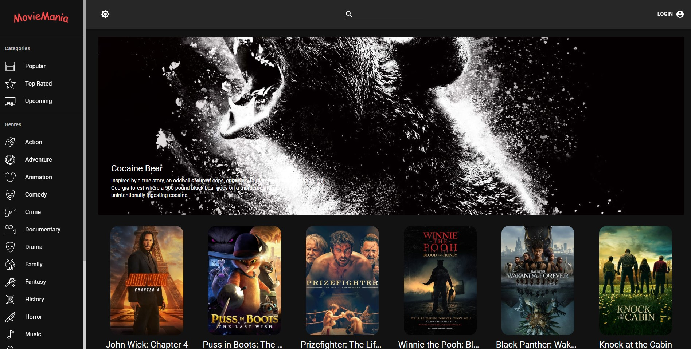

# MovieMania

This project was migrated from Create React App to Next.js.

MovieMania combines the desire to unleash powerful creativity with the industry's most advanced NextJS / JavaScript tools including React.js, Redux, Material UI, and more.

This application includes user authentication, dark mode, sort movie on the basis of categories or genres, viewing movie and actor details, adding a movie to favorites or watchlist and many more functionalities. 

Run locally:

1. npm install
2. npm run dev

Build and export static site (for GitHub Pages):

1. npm run build
2. npm run deploy

Notes:
- Routing has been migrated to Next.js pages under `pages/`.
- Global layout and navbar are provided in `pages/_app.tsx`.
- The old `public/index.html` has been removed; assets remain in `public/`.
- `qs` dependency was explicitly bumped to v6.14.1 to address a known vulnerability.